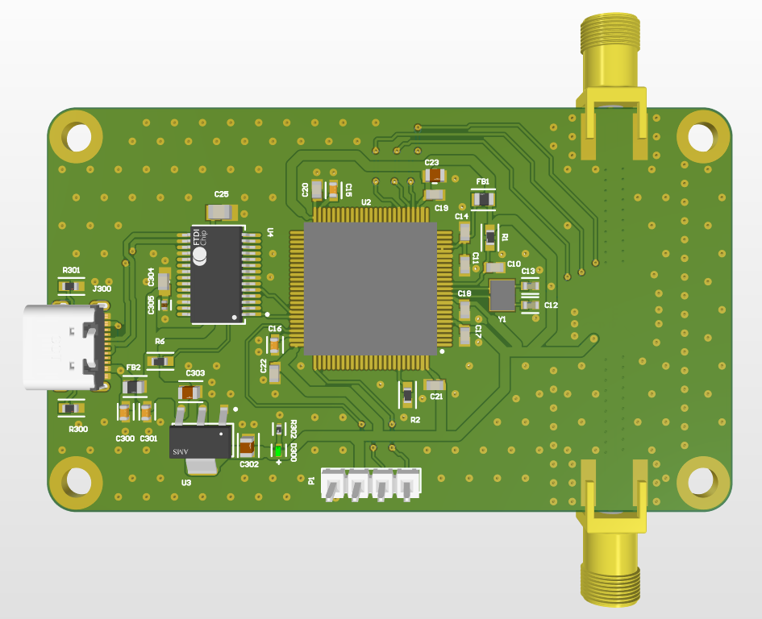
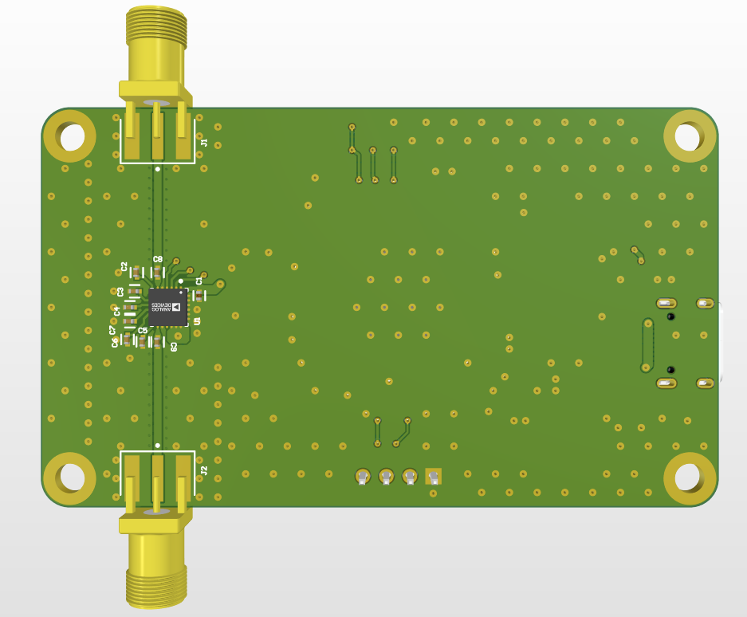
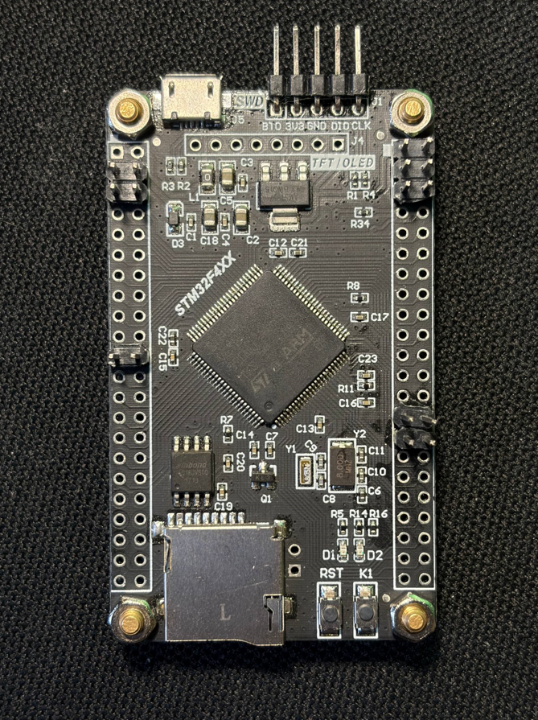

# rf-digital-attenuator-6ghz 📡


A professional open-source hardware project featuring a **6-bit Digital RF Attenuator** capable of operating up to 6 GHz. Controlled by an **STM32F407VET6** and based on the **HMC624A** (Analog Devices) silicon, this device provides precise signal level control via a simple USB-UART CLI or direct SPI interface.

---

## 🚀 Features

* **Wide Frequency Range:** Stable performance from 100 MHz to 6.0 GHz.
* **High Precision:** 6-bit attenuation with a fine 0.5 dB step resolution.
* **Robust RF Design:** 50 Ohm matched Coplanar Waveguides (CPW) optimized for 1.6mm FR4.
* **Dual Control:** Command-line interface (CLI) via FT232 USB-UART or high-speed SPI.
* **Plug-and-Play:** Powered and controlled through a single USB Type-C connector.

---

## 📊 Technical Specifications

| Parameter | Value | Notes |
| :--- | :--- | :--- |
| **Frequency Range** | 0.1 — 6.0 GHz | Optimized for 6 GHz |
| **Attenuation Range** | 0 — 31.5 dB | 6-bit control |
| **Step Size** | 0.5 dB | ±0.15 dB Typical Accuracy |
| **Insertion Loss** | ~2.2 dB | @ 2.0 GHz |
| **Input P1dB** | +24 dBm | 1dB Compression Point |
| **Control Interface** | UART (USB) / SPI | 115200 Baud |
| **Input Voltage** | 5.0 V | Via USB Type-C |

---

## 📸 Hardware Gallery

### PCB Overview
| Top View (MCU Side) | Bottom View (RF Side) |
| :---: | :---: |
|  |  |

### Key Components
| STM32F407VET6 | HMC624A Attenuator | FT232 UART Bridge |
| :---: | :---: | :---: |
|  |  |  |

---

## 📂 Project Structure

```text
├── hardware/          # Altium Designer project files
│   ├── PDF/           # Schematic exports in PDF format
│   └── Manufacturing/ # Production files (Gerber, BOM, Pick&Place)
├── firmware/          # STM32 Source Code (CubeIDE / Keil)
├── docs/              # Images and reference datasheets
└── README.md          # Project documentation
